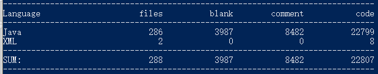
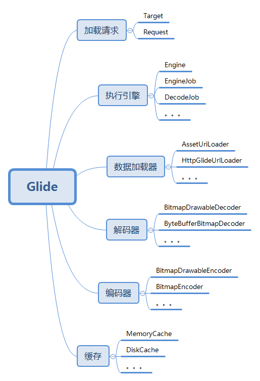
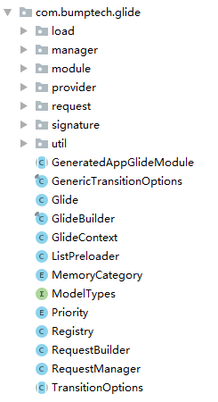
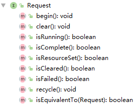
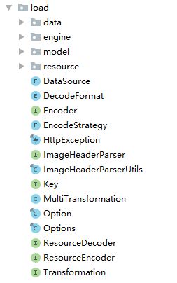
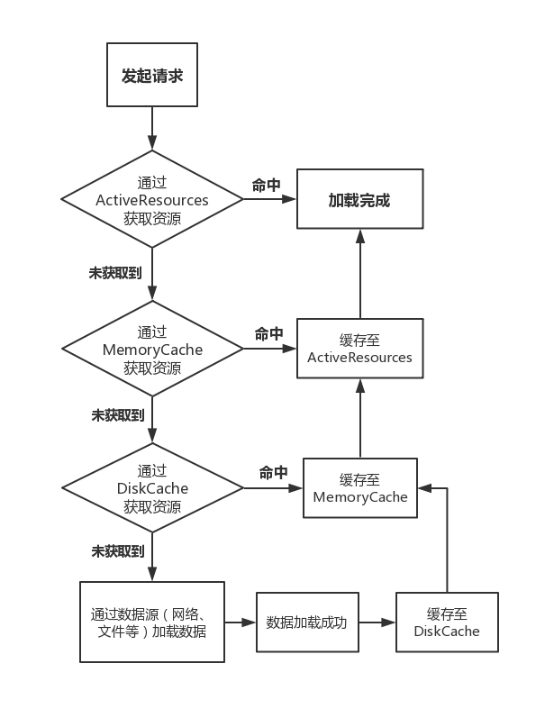
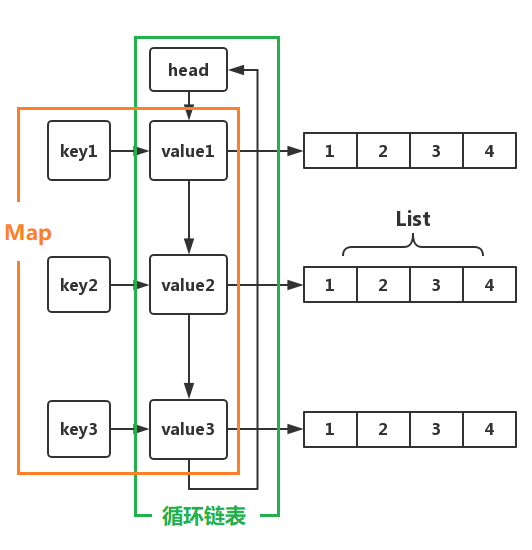
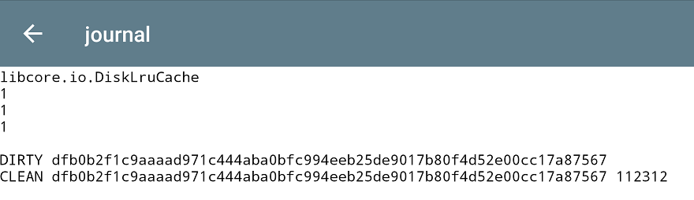
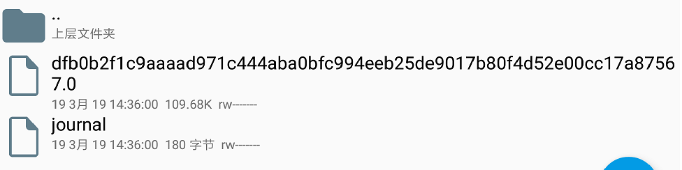

# 项目编译
--------
项目基于最新版 [Glide 4.9.0 源码](https://github.com/bumptech/glide)分析，通过如下方式获取并编译代码：
```git
git clone https://github.com/bumptech/glide.git
cd glide
./gradlew jar
```
代码量（使用 [cloc](http://cloc.sourceforge.net/) 统计）：



这么多的代码，直接看肯定让人头疼，理不清头绪，但好在 [Glide](https://github.com/bumptech/glide) 分包结构明确，我们可以先根据不同的模块来逐个击破。

# 总览
--------
有一点需要说明的是，Glide 源码很复杂， 涉及到的东西也很多，这里不能面面俱到，只是把我认为重要的东西介绍了一下，可能还有一些疏漏。

首先我将 Glide 分成了几个模块，让大家有个整体的印象，自顶向下的分析源码，从而实现降维打击。

按照逻辑功能划分，可以把 Glide 框架大概的分成如下几个部分：



Glide 大体上可以分为如上几个模块。

下面通过一个常用案例来分析整个流程。
一般来说，我们使用如下代码加载一张网络图片：
```java
Glide.with(this)
        .load(url)
        .into(imgView);
```
上面的三个方法都很眼熟吧，我们之前都已经介绍过了。
假设这是我们的 APP 第一次使用 Glide 加载一张图片，那么流程如下：


上面的流程是简化版，省去了一部分东西，可以通过这张图更直观的了解到 Glide 的加载流程以及机制。

看到上面这个流程图大家先别慌，下面我来慢慢介绍。

# 模块介绍
--------
根据模块学习事半功倍，先看看 Glide 的分包结构：



我在分析 Glide 源码前将 Glide 的项目 clone 到了本地，阅读时添加了很多注释以及自己的理解等等，现在已经推到了 Github 上，有兴趣的同学可以看看：
https://github.com/0xZhangKe/Glide-note

先看看最外层的几个类。

## Glide
--------
Glide 是**单例类**，通过 Glide#get(Context) 方法可以获取到实例。

Glide 类算是个**全局的配置类**，Encoder、Decoder、ModelLoader、Pool 等等都在这里设置，此外还提供了创建 RequestManager 的接口（Glide#with() 方法）。


使用 Glide 时会最先调用 Glide#with() 方法创建 RequestManager，Glide 中的 with() 方法有五个重载：
```java
RequestManager with(Context context)
RequestManager with(android.app.Activity)
RequestManager with(android.app.Fragment)
RequestManager with(android.support.v4.app.Fragment)
RequestManager with(android.support.v4.app.FragmentActivity)
```
Glide#with() 方法会将 RequestManager 的创建委托给 RequestManagerRetriever，RequestManagerRetriever 为单例类，调用 get(Context) 创建 RequestManager。


## GlideBuilder
--------

GlideBuilder 是用来创建 Glide 实例的类，其中包含了很多个 get/set 方法，例如设置 BitmapPool、MemoryCache、ArrayPool 等等，最终通过这些设置调用 build 方法构建 Glide，可以截取 build 方法中的一段代码来看一下：
```java
if (bitmapPool == null) {
    //创建 Bitmap 池
    int size = memorySizeCalculator.getBitmapPoolSize();
    if (size > 0) {
        bitmapPool = new LruBitmapPool(size);
    } else {
        bitmapPool = new BitmapPoolAdapter();
    }
}
​
//创建数组池
if (arrayPool == null) {
    arrayPool = new LruArrayPool(memorySizeCalculator.getArrayPoolSizeInBytes());
}
​
//创建内存缓存
if (memoryCache == null) {
    memoryCache = new LruResourceCache(memorySizeCalculator.getMemoryCacheSize());
}
​
//创建磁盘缓存
if (diskCacheFactory == null) {
    diskCacheFactory = new InternalCacheDiskCacheFactory(context);
}
```

上面截取的几行代码很具有代表性，这些数组池、缓存实现等等最终都会当做 Glide 构造器的参数创建 Glide 实例。


## RequestManagerRetriever
--------
上面说的 5 个重载的 Glide#with() 方法对应 RequestManagerRetriever 中的 5 个重载的 get() 方法。
由于这个比较重要，而且跟我们使用息息相关，所以仔细的说一下~

创建 RequestManager 逻辑如下：

 1. 如果 with 方法的参数为 Activity 或者 Fragment ，则最终调用 RequestManagerRetriever 中的 fragmentGet(Context, android.app.FragmentManager) 方法创建 RequestManager；
 2. 如果 with 方法的参数为 android.support.v4.app.Fragment 或者android.support.v4.app.FragmentActivity，则最终调用 supportFragmentGet(Context, android.support.v4.app.FragmentManager) 方法创建 RequestManager；
 3. 如果 with 方法的参数为 Context，则会判断其来源是否属于 FragmentActivity 及 Activity，是则按照上面的逻辑进行处理，否则最终调用 getApplicationManager(Context) 方法创建 RequestManager。


上面说的情况有个条件都是在主线程调用 Glide#with() 方法， 如果子线程调用 Glide#with()  或者系统版本小于 17，则最终会调用 getApplicationManager(Context) 方法创建 RequestManager 。

也就是说，无论使用什么参数，最终都会进入如下三个方法创建 RequestManager：
```java
RequestManager fragmentGet(Context context, android.app.FragmentManager fm);
RequestManager supportFragmentGet(Context context, android.support.v4.app.FragmentManager fm);
RequestManager getApplicationManager(Context context);
```

可以看到这三个方法作用都是用来创建 RequestManager，前两个方法主要是用来兼容 support 包中的 FragmentActivity、Fragment。

至于为什么需要传入一个 FragmentManager 参数留在后面说。

此外还有一种情况，即在**子线程**调用 Glide#with() 方法或传入 Context 对象为 ApplicationContext，此时会创建一个全局唯一的 RequestManager，生命周期与 APP 周期保持一致。

根据上述规则可以得出以下几个结论：

 1. 同一个 Activity 对应一个 FragmentManager，一个 FragmentManager 对应一个 RequestManagerFragment，一个 RequestManagerFragment 对应一个 RequestManager，所以**一个 Activity 对应 一个 RequestManager**；
 2. 同一个 Fragment 同样可得出上述结论；
 3. 但如果 Fragment 属于 Activity，或者 Fragment 属于 Fragment，在 Activity、Framgnent 中分别创建 Glide 请求是并不会只创建一个 RequestManager；
 4. **子线程**发起 Glide 请求或传入对象为 ApplicationContext，则使用全局单例的 RequestManager。

## RequestManager
--------
RequestManager 主要由两个作用：

 1. 创建 RequestBuilder ；
 2. 通过生命周期管理请求的启动结束等。

我们都知道使用 Glide 加载图片时，如果当前页面被销毁或者不可见时会停止加载图片，但我们使用 Glide 加载图片时并没有显示的去设置 Glide 与当前页面的生命周期关联起来，只是传了个 Context 对象，那么 Glide 是如何通过一个上下文对象就能获取到页面生命周期的呢？

通过上面 RequestManagerRetriever 章节的介绍我们知道创建 RequestManager 时需要一个 FragmentManager 参数（全局 RequestManager 除外），那么再创建 RequestManager 时会**先创建一个不可见的 Fragment** ，通过 FM 加入到当前页面，用这个不可见的 Fragment 即可检测页面的生命周期。代码中保证了每个 Activity/Fragment 中只包含一个 RequestManagerFragment 与 一个 RequestManager。

创建 RequestBuilder 的 load 方法有很多：
```java
RequestBuilder<Drawable> load(@Nullable Bitmap bitmap);
RequestBuilder<Drawable> load(@Nullable Drawable drawable);
RequestBuilder<Drawable> load(@Nullable String string);
RequestBuilder<Drawable> load(@Nullable Uri uri);
RequestBuilder<Drawable> load(@Nullable File file);
RequestBuilder<Drawable> load(@RawRes @DrawableRes @Nullable Integer resourceId);
RequestBuilder<Drawable> load(@Nullable URL url);
RequestBuilder<Drawable> load(@Nullable byte[] model);
RequestBuilder<Drawable> load(@Nullable Object model);
```

看看有这么多重载方法，没一个都代表不同的加载源。
除此之外还有两个特殊的方法：
```java
RequestBuilder<File> downloadOnly();
RequestBuilder<File> download(@Nullable Object model);
```
这两个听名字就知道是用来下载图片的。

## RequestBuilder
--------
RequestBuilder 用来构建请求，例如设置 RequestOption、缩略图、加载失败占位图等等。
上面说到的 RequestManager 中诸多的 load 重载方法，同样也对应 RequestBuilder 中的重载 load 方法，一般来说 load 方法之后就是调用 into 方法设置 ImageView 或者 Target，into 方法中最后会创建  Request，并启动，这个后面会详细介绍。


## Request
--------
顾名思义， request 包下面的是封装的请求，里面有一个 Request 接口，估计所有的请求都是基于这个接口的，看一下：



接口定义了对请求的开始、结束、状态获取、回收等操作，所以请求中不仅包含基本的信息，还负责管理请求。
Request 主要的实现类有三个：

 1. SingleRequest
 2. ThumbnailRequestCoordinator
 3. ErrorRequestCoordinator

一个个看。


### SingleRequest
--------
这个类负责执行请求并将结果反映到 Target 上。

当我们使用 Glide 加载图片时，会先根据 Target 类型创建不同的 Target，然后 RequestBuilder 将这个 target 当做参数创建 Request 对象，Request 与 Target 就是这样关联起来的。

这里就会先创建一个包含 Target 的 SingleRequest 对象。考虑到性能问题，可能会连续创建很多个 SingleRequest 对象，所以使用了对象池来做缓存。
再来说说 SingleRequest 的请求发起流程。

我们经常在 Activity#onCreate 方法中直接使用 Glide 方法，但此时的图片大小还未确定，所以调用 Request#begin 时并不会直接发起请求，而是等待 ImageView 初始化完成，对于 ViewTarget 以及其子类来说，会注册View 的 OnPreDrawListener 事件，等待 View 初始化完成后就调用 SingleRequest#onSizeReady 方法，这个方法里就会开始加载图片了。

onSizeReady 方法并不会去直接加载图片，而是调用了 Engine#load 方法加载，这个方法差不多有二十个参数，所以 onSizeReady 方法算是用来构建参数列表并且调用 Engine#load 方法的。

clear 方法用于停止并清除请求，主要就是从 Engine 中移除掉这个任务以及回调接口。
另外，SingleRequest 实现了 ResourceCallback 接口，这个接口就连个方法：
```java
void onResourceReady(Resource<?> resource, DataSource dataSource);
void onLoadFailed(GlideException e);
```
即资源加载完成和加载失败的两个回调方法，刚刚说的 Engine#load 方法中有差不多二十个参数，其中有一个参数就是这个接口。那再来说这两个方法在 SingleRequest  中的实现。
其实很简单，重点就是调用 Target#onResourceReady 方法以及构建图片加载完成的动画，另外还要通知 ThumbnailRequestCoordinator 图片加载完成。
onLoadFailed 方法流程大体上也类似 onResourceReady。
那 SingleRequest  就差不多这样了。

### ThumbnailRequestCoordinator
--------
这个类是用来**协调两个请求**，因为有的请求需要同时加载原图和缩略图，比如启动这两个请求、原图加载完成后缩略图其实就不需要加载了等等，这些控制都由这个类来操作。
RequestBuilder 中会将缩略图和原图的两个 SingleRequest  都交给它，后面再对其操作时都由这个类来同一控制。
所以这个类其实没什么太多的功能，就是对两个对象的一个统一个管理协调包装。

### ErrorRequestCoordinator
--------
RequestBuilder 的父类 BaseRequestOptions 中有几个 error 的重载方法：
```java
T error(@Nullable Drawable drawable);
T error(@DrawableRes int resourceId);
```
一般地，我们会使用这个方法设置一个加载失败时的填充图，大部分情况下都是一个通过 resource 资源文件中获取到的图片 ID 或者 Drawable。
但 RequestBuilder 中还提供了另一个 error 方法：
```java
RequestBuilder<TranscodeType> error(@Nullable RequestBuilder<TranscodeType> errorBuilder);
```
考虑这样的一个场景，当我们加载失败时我可能希望继续去通过网络或者别的什么加载另一张图片，例如：
```java
Glide.with(context)
    .load((Object) null)
    .error(
        Glide.with(context)
            .load(errorModel)
            .listener(requestListener))
    .submit();
```
当我们这样使用 error 时最终就会创建一个 ErrorRequestCoordinator 对象，这个类的功能类似 ThumbnailRequestCoordinator，其中也没多少代码，主要用来协调 ThumbnailRequestCoordinator 以及 error 中的 Request。

通过上面的介绍就已经对 Request 的作用以及子类有一定的了解了，上面多次提到过 Target 是另一个很重要的概念，下面接着看一下这个类。

### Target
--------
Target 代表一个**可被 Glide 加载并且具有生命周期的资源**。
当我们调用 RequestBuilder#into 方法时会根据传入参数创建对应类型的 Target 实现类。

那么 Target 在 Glide 的整个加载流程中到底扮演者什么样的角色呢？Target 的中文意思为：**目标**，实际上就是指加载完成后的图片应该放在哪， Target 默认提供了很多很有用的实现类，当然我们也可以自定义 Target。

Glide 默认提供了用于放在 ImageView 上的 ImageViewTarget（以及其各种子类）、放在 AppWidget 上的 AppWidgetTarget、用于同步加载图片的 FutureTarget（只有一个实现类：RequestFutureTarget）等等，下面分别来看一下。

#### CustomViewTarget
--------
这个是抽象类，负责加载 Bitmap、Drawable 并且放到 View 上。

上文提到过，如果在 View 还未初始化完成时就调用了 Glide 加载图片会等待加载完成再去执行 onSizeReady 方法，那如何监听 View 初始化完成呢？
CustomViewTarget 就针对这个问题给出了解决方案，其中会调用 View#addOnAttachStateChangeListener 方法添加一个监听器，这个监听器可以监听到 View 被添加到 Widow 以及移除 Window 时的事件，从而更好的管理 Request 生命周期。

另外，构建好的 Request 会通过 View#setTag 方法存入 View 中，后面再通过 View#getTag 方法获取。

但这个抽象类并没有实现类，也没有被使用过，View 相关的 Target 都是继承 ViewTarget 抽象基类，但这个类已经被标记为过期类了，推荐将 ViewTarget 替换成 CustomViewTarget 使用。

#### ViewTarget
--------
这个类又继承了抽象类 BaseTarget，这个基类里只是实现了 Target 接口的 setRequest 以及 getRequest 方法。
ViewTarget 基本上类似 CustomViewTarget ，只是具体的实现上有点不同。

#### ImageViewTarget
--------
听名字就知道，这是加载到 ImageView 上的 Target，继承了 ViewTarget，同样也是个**抽象类**。

构造器中限定了**必须传入 ImageView 或者其子类**，图片数据加载完成后会回调其中的 onResourceReady 方法，第一步是将图片设置给 ImageView，第二部是判断是否需要使用动画，需要的话就执行动画。

ImageViewTarget 的实现类比较多，总共有 5 个，但内容都很简单，主要用于区分加载的资源时 Bitmap 类型还是 Drawable 类型，这个在构建请求时确定，默认的加载请求最终都是 Drawable 类型，但如果构建请求时调用了 asBitmap  方法那就资源就会被转成 Bitmap 类型，另外一个就是资源使用缩略图展示。

#### RequestFutureTarget
--------
这是用来同步加载图片的 Target，调用 RequestBuilder#submit 将会返回一个 FutureTarget，调用 get 方法即可获取到加载的资源对象。

#### AppWidgetTarget
--------
用于将下载的 Bitmap 设置到 RemoteView 上。

#### NotificationTarget
--------
与 AppWidgetTarget 类似，不同的是这是用来将 Bitmap 设置到 Notification 中的 RemoteView 上。

## module
--------
module 包下面的 GlideModel 比较重要，需要详细说一下。

这是用来**延迟设置 Glide 相关参数**的，我们可以通过这个接口使 Glide 在初始化时应用我们的设置，因为 Glide 是单例类，通过这个设置可以保证在 Glide 单例类初始时，所有请求发起之前应用到 Glide。

GlideModel 是个接口，所以代码很简单：
```java
@Deprecated
public interface GlideModule extends RegistersComponents, AppliesOptions { }
```
可以看到该接口被标识已过期，Glide 推荐使用 AppGlideModule 替代，不用管他。

GlideModel 接口本身没有代码内容，但其继承了 RegistersComponents 与 AppliesOptions 接口，先分别看一下这两个接口。


### RegistersComponents
--------
这是用来注册 Glide 中一些组件的，这个接口只有一个方法：
```java
void registerComponents(@NonNull Context context, @NonNull Glide glide,
      @NonNull Registry registry);
```
这个方法中提供了一个 Registry 对象，这是用来管理注册 ModelLoader、Encoder、Decoder 等等，具体可以看看 Registry 提供的公开方法。

例如我们可以在这里注册自己的 ModelLoader，比如我们的网络请求使用的 OkHttp，Glide 默认使用的是HttpURLConnection，我们想改成 OkHttp 就可以在这里设置，具体的使用方式[点此查看使用案例。](https://github.com/0xZhangKe/Glide-note/blob/master/integration/okhttp3/src/main/java/com/bumptech/glide/integration/okhttp3/OkHttpGlideModule.java)


### AppliesOptions
--------
这是用来管理一些 Glide 的参数设置项，同样只有一个方法。
```java
void applyOptions(@NonNull Context context, @NonNull GlideBuilder builder);
```
这个方法提供了一个 GlideBuilder 参数，这是用来构建 Glide 的，我们可以使用 GlideBuilder 对象提供的公开方法做一些设置，例如设置线程池、设置 BitmapPool/ArrayPoll 等等。


那么说完这两个接口，在回过头来看看 GlideModel ，通过上面的描述已经明白 GlideModel 中两个方法的作用了，再来看看如何使用。

Glide 在实例化时会解析 manifest 文件并从中获取 value 为  GlideModule 的 meta-data 配置信息，我们定义好自己的 GlideModule 之后需要在 manifest 文件中进行配置，配置方式如下：
```xml
<meta-data
        android:name="com.zhangke.glide.samples.OkHttpGlideModule"
        android:value="GlideModule"/>
```

其中 OkHttpGlideModule 必须实现 GlideModel 接口。
具体的[配置方式点此查看](https://github.com/0xZhangKe/Glide-note/tree/master/integration/okhttp3)。

此外，Glide 默认提供了很多 ModelLoader，基本上可以满足所有场景的使用。
ModelLoader 的具体作用与机制后面会详细介绍。

## load
--------



load 包下面是加载资源的核心，里面的东西很多，也很复杂，所以我先把其中两个比较重要的接口介绍完了在介绍别的。

### ModelLoader
--------
类路径：
```java
com.bumptech.glide.load.model.ModelLoader
```

工厂接口，用于将任意复杂的数据模型转换为可由 DataFetcher  用于获取模型所代表的资源的数据的具体数据类型。叫他加载器比较合适，用来加载资源的。

除此之外，还允许将图片按照 ImageView 大小按需加载。防止浪费内存。

Glide 初始化时会注册很多个 ModelLoader ，除了Glide 默认提供的之外还会注册用户在 manifest 中配置的 ModelLoader，也就是上面 GlideModel 章节介绍的内容。

ModelLoader 中有两个方法以及一个内部类：LoadData，下来看看这两个方法：
```java
@Nullable
LoadData<Data> buildLoadData(@NonNull Model model, int width, int height,
                                 @NonNull Options options);
boolean handles(@NonNull Model model);
```

buildLoadData 方法除了包含 Model 之外还有宽高以及 Option，所以光看参数列表应该能猜到，加载图片时可以根据需要的宽高以及其他设置做到按需加载。
返回的是 LoadData 实例，这个类待会再说。所以这个方法的意义就是通过参数构建一个 LoadData 实例。

handles 方法比较简单，就是用来判断给定模型是不是此加载器可能加载的已识别类型。

至于内部类 LoadData 呢，主要作用就是装了三个东西：

 1. 用于识别资源唯一性的 Key;
 2. 缓存相关的备用 Key 列表
 3. DataFetcher

其中 DataFetcher最重要，为什么说它是最重要的呢，因为加载资源的根源就在这里（找了半天终于找到了），例如发起网络请求等等，都在这个里面。
那既然说到了 DataFetcher 就在说说它。

### DataFetcher
--------
类路径：
```java
com.bumptech.glide.load.data.DataFetcher
```
DataFetcher 也是个接口，其中最重要的一个方法就是 loadData，听名字就很重要是吧：**加载数据**。

内部实现就是通过 HttpUrlConnect 发起网络请求，或者打开一个文件，或者使用 AssetManager 打开一个资源等等。。。

加载完成后通过 DataFetcher$DataCallback 接口回调。

DataCallback 中包含两个方法：
```java
void onDataReady(@Nullable T data);
void onLoadFailed(@NonNull Exception e);
```
分别代表数据加载成功或者加载失败回调。


## Encoder
--------
Encoder 是个接口，在 Glide 中也是个很重要的概念，用来将给定的数据写入持久性存储介质中（文件）。

其中只有一个方法：
```java
public interface Encoder<T> {
  /**
   * Writes the given data to the given output stream and returns True if the write completed
   * successfully and should be committed.
   *
   * @param data The data to write.
   * @param file The File to write the data to.
   * @param options The put of options to apply when encoding.
   */
  boolean encode(@NonNull T data,
                 @NonNull File file,
                 @NonNull Options options);
}
```
比较简单，注释写的很清楚了，就是把 data 存入文件中。

数据加载完成之后会先使用 Encoder 将数据存入本地磁盘缓存文件中。
同样，Encoder 对应的实现类都是在 Glide 初始化时注册进去的。

## ResourceDecoder
--------
与 Encoder 对应，**数据解码器**，用来**将原始数据解码成相应的数据类型**，针对不同的请求实现类都不同，例如通过网络请求最终获取到的是一个 InputStream，经过 ByteBufferBitmapDecoder 解码后再生成一个 Bitmap。

需要指出的是，这里解码时会根绝 option 以及图片大小（如果有的话）按需加载 Bitmap，防止内存的浪费。

与 Encoder 一样，Glide 初始化时会注册很多个类型的 ResourceDecoder 实现类，图片数据获取到之后会根据不同的类型使用对应的解码器对其解码。

## Engine
--------
上面的 Request 中也讲到了 Engine 这个类，可理解为**执行引擎**，算是整个 Glide 的核心发动机。

Engine 负责管理请求以及活动资源、缓存等。主要关注 load 方法，这个方法主要做了如下几件事：

 1. 通过请求构建 Key；
 2. 从活动资源中获取资源（详见缓存章节），获取到则返回；
 3. 从缓存中获取资源，获取到则直接返回；
 4. 判断当前请求是否正在执行，是则直接返回；
 5. 构建 EngineJob 与 DecodeJob 并执行。

关于缓存相关的都在缓存章节。下面说说 EngineJob 与 DecodeJob。

## EngineJob
--------
这个主要用来执行 DecodeJob 以及管理加载完成的回调，各种监听器，没有太多其他的东西。

## DecodeJob
--------
负责从缓存或数据源中加载原始数据并通过解码器转换为相应的资源类型（Resource）。DecodeJob 实现了 Runnable 接口，由 EngineJob 将其运行在指定线程池中。

首次加载一张图片资源时，资源加载完成后会先存入到本地缓存文件中，然后再从文件中获取。

上面已经说过，图片的加载最终是通过 DataFetcher 来实现，但是此处并没有直接这么调用，考虑到缓存文件，这里面使用的是 DataFetcherGenerator，其有三个实现类，对应不同的加载方式，这里就不多做介绍了，只需要知道它会根据资源类型去 Glide 中获取已注册的 DataFetcher ，然后**通过 DataFetcher#loadData 方法获取原始数据**，获取完成后使用 Encoder 将数据存入磁盘缓存文件中，同时使用对应的解码器将原始数据转换为相应的资源文件，这样整个流程就差不多结束了。


# 缓存模块
--------
缓存模块涉及到的东西比较多，比较重要。

关于缓存的获取、数据加载相关的逻辑在 [Engine#load](https://github.com/0xZhangKe/Glide-note/blob/master/library/src/main/java/com/bumptech/glide/load/engine/Engine.java#L151) 方法中。
先来看看缓存流程，流程如下图：



全部的缓存流程大致如上图所示。

[Glide](https://github.com/0xZhangKe/Glide-note) 实例化时会实例化三个缓存相关的类以及一个计算缓存大小的类：
```java
//根据当前机器参数计算需要设置的缓存大小
MemorySizeCalculator calculator = new MemorySizeCalculator(context);
//创建 Bitmap 池
if (bitmapPool == null) {
    if (Build.VERSION.SDK_INT >= Build.VERSION_CODES.HONEYCOMB) {
        int size = calculator.getBitmapPoolSize();
        bitmapPool = new LruBitmapPool(size);
    } else {
        bitmapPool = new BitmapPoolAdapter();
    }
}
//创建内存缓存
if (memoryCache == null) {
    memoryCache = new LruResourceCache(calculator.getMemoryCacheSize());
}
//创建磁盘缓存
if (diskCacheFactory == null) {
    diskCacheFactory = new InternalCacheDiskCacheFactory(context);
}
```
除此之外 Engine 中还有一个 ActiveResources 作为第一级缓存。下面分别来介绍一下。

## ActiveResources
--------
ActiveResources 是**第一级缓存**，表示当前正在活动中的资源。
类路径：
```
com.bumptech.glide.load.engine.ActiveResources
```
Engine#load 方法中构建好 Key 之后第一件事就是去这个缓存中获取资源，获取到则直接返回，获取不到才继续从其他缓存中寻找。

当资源加载成功，或者通过缓存中命中资源后都会将其放入 ActivityResources 中，资源被释放时移除出 ActivityResources 。

由于其中的生命周期较短，所以**没有大小限制**。

ActiveResources 中通过一个 Map 来存储数据，数据保存在一个**虚引用**（WeakReference）中。

刚刚说的 activeResource 使用一个 Map<Key, WeakReference<EngineResource<?>>> 来存储的，此外还有一个引用队列：
```
ReferenceQueue<EngineResource<?>> resourceReferenceQueue;
```

每当向 activeResource 中添加一个 WeakReference 对象时都会将 resourceReferenceQueue 和这个 WeakReference 关联起来，用来跟踪这个 WeakReference 的 gc，一旦这个弱引用被 gc 掉，就会将它从 activeResource 中移除，ReferenceQueue 的具体作用可以自行谷歌，大概就是用来**跟踪弱引用（或者软引用、虚引用）是否被 gc 的。**

那么 ReferenceQueue 具体是在何时去判断 WeakReference 是否被 gc 了呢，Handler 机制大家应该都知道，但不知道大家有没有用过 MessageQueue.IdleHandler 这个东东，可以调用 MessageQueue#addIdleHandler 添加一个 MessageQueue.IdleHandler 对象，Handler 会在**线程空闲时调用这个方法**。resourceReferenceQueue 在创建时会创建一个 Engine#RefQueueIdleHandler 对象并将其添加到当前线程的 MessageQueue 中，ReferenceQueue 会在 IdleHandler 回调的方法中去判断 activeResource 中的 WeakReference 是不是被 gc 了，如果是，则将引用从 activeResource 中移除，代码如下：
```java
//MessageQueue 中的消息暂时处理完回调
@Override
public boolean queueIdle() {
    ResourceWeakReference ref = (ResourceWeakReference) queue.poll();
    if (ref != null) {
        activeResources.remove(ref.key);
    }
    //返回 true，表示下次处理完仍然继续回调
    return true;
}
```

## MemorySizeCalculator
--------
这个类是用来计算 BitmapPool 、ArrayPool 以及 MemoryCache **大小**的。
计算方式如下：
```java
//默认为 4MB，如果是低内存设备则在此基础上除以二
arrayPoolSize =
        isLowMemoryDevice(builder.activityManager)
                ? builder.arrayPoolSizeBytes / LOW_MEMORY_BYTE_ARRAY_POOL_DIVISOR
                : builder.arrayPoolSizeBytes;
//其中会先获取当前进程可使用内存大小，
//然后通过判断是否是否为低内存设备乘以相应的系数，
//普通设备是乘以 0.4，低内存为 0.33，这样得到的是 Glide 可使用的最大内存阈值 maxSize
int maxSize =
        getMaxSize(
                builder.activityManager, builder.maxSizeMultiplier, builder.lowMemoryMaxSizeMultiplier);
​
int widthPixels = builder.screenDimensions.getWidthPixels();
int heightPixels = builder.screenDimensions.getHeightPixels();
//计算一张格式为 ARGB_8888 ，大小为屏幕大小的图片的占用内存大小
//BYTES_PER_ARGB_8888_PIXEL 值为 4
int screenSize = widthPixels * heightPixels * BYTES_PER_ARGB_8888_PIXEL;
​
int targetBitmapPoolSize = Math.round(screenSize * builder.bitmapPoolScreens);
​
int targetMemoryCacheSize = Math.round(screenSize * builder.memoryCacheScreens);
//去掉 ArrayPool 占用的内存后还剩余的内存
int availableSize = maxSize - arrayPoolSize;
​
if (targetMemoryCacheSize + targetBitmapPoolSize <= availableSize) {
    //未超出内存限制
    memoryCacheSize = targetMemoryCacheSize;
    bitmapPoolSize = targetBitmapPoolSize;
} else {
    //超出内存限制
    float part = availableSize / (builder.bitmapPoolScreens + builder.memoryCacheScreens);
    memoryCacheSize = Math.round(part * builder.memoryCacheScreens);
    bitmapPoolSize = Math.round(part * builder.bitmapPoolScreens);
}
```
直接看上面的注释即可。


## BitmapPool
--------
Bitmap 是用来**复用 Bitmap** 从而避免重复创建 Bitmap 而带来的内存浪费，Glide 通过 SDK 版本不同创建不同的 BitmapPool 实例，版本低于 Build.VERSION_CODES.HONEYCOMB(11) 实例为 BitmapPoolAdapter，其中的方法体几乎都是空的，也就是是个实例不做任何缓存。
否则实例为 LruBitmapPool，先来看这个类。

### LruBitmapPool
--------
LruBitmapPool 中没有做太多的事，主要任务都交给了 **LruPoolStrategy**，这里只是做一些缓存大小管理、封装、日志记录等等操作。

每次调用 put 缓存数据时都会调用 trimToSize 方法判断已缓存内容是否大于设定的最大内存，如果大于则使用 LruPoolStrategy#removeLast 方法逐步移除，直到内存小于设定的最大内存为止。

LruPoolStrategy 有两个实现类：SizeConfigStrategy 以及 AttributeStrategy，根据系统版本创建不同的实例，这两个差异不大，KITKAT 之后使用的都是 SizeConfigStrategy，这个比较重要。

#### SizeConfigStrategy
--------
SizeConfigStrategy 顾名思义，是通过 Bitmap 的 size 与 Config 来当做 key 缓存 Bitmap，Key 也会通过 KeyPool 来缓存在一个队列（Queue）中。

与  AttributeStrategy 相同的是，其中都使用 Glide 内部自定义的数据结构：**GroupedLinkedMap** 来存储 Bitmap。

当调用 put 方法缓存一个 Bitmap 时会先通过 Bitmap 的大小以及 Bitmap.Config 创建（从 KeyPool 中获取）Key，然后将这个 Key 与 Bitmap 按照键值对的方式存入 GroupedLinkedMap  中。

此外其中还包含一个 sortedSizes，这是一个 HashMap，Key 对应 put 进来的 Bitmap.Config，value 对应一个 TreeMap，TreeMap 中记录着每一个 size 的 Bitmap 在当前缓存中的个数，即 put 时加一，get 时减一。

TreeMap 是**有序的**数据结构，当需要通过 Bitmap 的 size 与 Config 从缓存中获取一个 Biamp 时未必会一定要获取到 size 完全相同的 Bitmap，由于 TreeMap 的特性，调用其 ceilingKey 可以获取到一个相等或大于当前 size 的一个最小值，用这个 Key 去获取 Bitmap，然后重置一下大小即可。

重点看一下 GroupedLinkedMap，这是 Glide 为了 实现 [LRU 算法](https://baike.baidu.com/item/LRU)自定义的一个数据结构，看名字是已分组的链表 Map？看一下下面的图就明白了：



其中包含三种数据结构：哈希表（HashMap）、[循环链表](https://zh.wikipedia.org/wiki/%E5%BE%AA%E7%8E%AF%E9%93%BE%E8%A1%A8)以及列表（ArrayList）。
这个结构其实类似 Java 里提供的 [LinkedHashMap](https://docs.oracle.com/javase/8/docs/api/java/util/LinkedHashMap.html) 类。

循环链表是通过内部类 GroupedLinkedMap$LinkedEntry 实现的，其中除了定义了链表结构需要的上下两个节点信息之外还包含着一个 Key 与一个 Values，定义如下：
```java
private static class LinkedEntry<K, V> {
    private final K key;
    private List<V> values;
    LinkedEntry<K, V> next;
    LinkedEntry<K, V> prev;

    ...
}
```
其实就是将 HashMap 的 Values 使用**链表**串了起来，每个 Value 中又存了个 **List**。

调用 put 方法时会先根据 Key 去这个 Map 中获取 LinkedEntry，获取不到则创建一个，并且加入到链表的尾部，然后将 value （也就是 Bitmap）存入 LinkedEntry 中的 List 中。

所以这里说的分组指的是通过 Key 来对 Bitmap 进行分组，对于同一个 Key（size 与 config 都相同）的 Bitmap 都会存入同一个 LinkedEntry 中。

调用 get 方法获取 Bitmap 时会先通过 Key 去 keyToEntry 中获取 LinkedEntry 对象，获取不到则创建一个，然后将其加入到链表头部，此时已经有了 LinkedEntry 对象，调用 LinkedEntry#removeLast 方法返回并删除 List 中的最后一个元素。

通过上面两步可以看到之所以使用链表是为了**支持 LRU 算法**，最近使用的 Bitmap 都会移动到链表的前端，使用次数越少就越靠后，当调用  removeLast 方法时就直接调用链表最后一个元素的 removeLast 方法移除元素。

好了 BitmapPool 大概就这么多内容，总结一下：

 1. BitmapPool 大小通过 MemorySizeCalculator 设置；
 2. 使用 LRU 算法维护 BitmapPool ；
 3. Glide 会根据 Bitmap 的大小与 Config 生成一个 Key；
 4. Key 也有自己对应的对象池，使用 Queue 实现；
 5. 数据最终存储在 GroupedLinkedMap 中；
 6. GroupedLinkedMap 使用哈希表、循环链表、List 来存储数据。


## MemoryCache
--------
相比较而言内存缓存就简单多了，如果从上面说的 ActiveResources 中没获取到资源则开始从这里寻找。
内存缓存同样使用 **LRU 算法**，实现类为 LruResourceCache，这个类没几行代码，继承了 LruCache ，所以着重看一下 LruCache 好了。

其实 Java 集合里面提供了一个很好的用来实现 LRU 算法的数据结构，即上面提到过的 **LinkedHashMap**。其基于 HashMap 实现，同时又将 HashMap 中的 Entity 串成了一个双向链表。
LruCache 中就是使用这个集合来缓存数据，其中代码量也不多，主要就是在 LinkedHashMap 的基础上又提供了对内存的管理的几个操作。

特别地，LruResourceCache 中提供了一个 ResourceRemovedListener 接口，当有资源从 MemoryCache 中被移除时会回调其中的方法，Engine 中接收到这个消息后就会进行 Bitmap 的回收操作。

## 磁盘缓存
--------
缓存路径默认为 Context#getCacheDir() 下面的 image_manager_disk_cache 文件夹，默认缓存大小为 250MB。

磁盘缓存实现类由 InternalCacheDiskCacheFactory 创建，最终会通过缓存路径及缓存文件夹最大值创建一个 DiskLruCacheWrapper 对象。

DiskLruCacheWrapper 实现了 DiskCache 接口，接口主要的代码如下：
```java
File get(Key key);
void put(Key key, Writer writer);
void delete(Key key);
void clear();
```
可以看到其中提供了作为一个缓存类必须的几个方法，并且文件以 Key 的形式操作。

**SafeKeyGenerator** 类用来将 Key 对象转换为字符串，Key 不同的实现类生成 Key 的方式也不同，一般来说会通过图片宽高、加密解码器、引擎等等生成一个 byte[] 然后再转为字符串，以此来保证图片资源的**唯一性**。

另外，在向磁盘写入文件时（put 方法）会使用**重入锁**来同步代码，也就是 DiskCacheWriteLocker 类，其中主要是对 **ReentrantLock** 的包装。

DiskLruCacheWrapper 顾名思义也是一个包装类，包装的是 **DiskLruCache**，那再来看看这个类。

### DiskLruCache
--------
这里考虑一个问题，磁盘缓存同样使用的是 LRU 算法，但文件是存在磁盘中的，如何在 APP 启动之后准确的按照使用次数排序读取缓存文件呢？

Glide 是使用一个**日志清单文件**来保存这种顺序，DiskLruCache 在 APP 第一次安装时会在缓存文件夹下创建一个 **journal** 日志文件来记录图片的添加、删除、读取等等操作，后面每次打开 APP 都会读取这个文件，把其中记录下来的缓存文件名读取到 LinkedHashMap 中，后面每次对图片的操作不仅是操作这个 LinkedHashMap 还要记录在 journal 文件中.
journal 文件内容如下图：



开头的 libcore.io.DiskLruCache 是魔数，用来标识文件，后面的三个 1 是版本号 valueCount 等等，再往下就是图片的操作日志了。

DIRTY、CLEAN 代表操作类型，除了这两个还有 REMOVE 以及 READ，紧接着的一长串字符串是文件的 Key，由上文提到的 SafeKeyGenerator 类生成，是由图片的宽、高、加密解码器等等生成的 SHA-256 散列码 后面的数字是图片大小。

根据这个字符串就可以在同目录下找到对应的图片缓存文件，那么打开缓存文件夹即可看到上面日志中记录的文件：



可以看到日志文件中记录的缓存文件就在这个文件夹下面。

由于涉及到磁盘缓存的外部排序问题，所以相对而言磁盘缓存比较复杂。

那么 Glide 的缓存模块至此就结束了，主要是  BitmapPool 中的数据结构以及磁盘缓存比较复杂，其他的倒也不是很复杂。

# 结语
--------
至此，Glide 源码分析就结束了，对于像 Glide 这种优秀的源码看一遍能学到很多东西，受益匪浅，而且源码是越看越熟，看得多了，再去看别的框架就很简单，俗话说，阅读一个优秀的框架源码，就好比再跟一个伟大的人谈话。后面我还会继续出一篇关于阅读源码技巧的博客。


如果觉得还不错的话，欢迎关注我的个人公众号，我会不定期发一些干货文章~


也可以加我微信：


